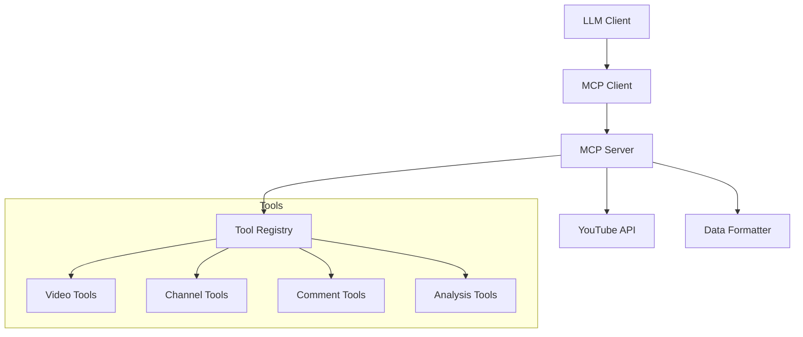

# YouTube MCP Server

Model Contex Protocol (MCP) server that enables AI models to interact with YouTube content through a standardized interface. This server provides a set of tools for video search, content analysis, comment processing, and more.

## 🌟 Features

- 🔍 **Video Search & Discovery**

  - Search YouTube videos
  - Get trending videos
  - Find related content
  - Channel information

- 📊 **Content Analysis**

  - Detailed video information
  - Channel statistics
  - Video transcripts
  - Comprehensive summaries

- 💬 **Social Features**
  - Comment retrieval
  - Comment analysis
  - User interaction data

## 🚀 Quick Start

### Prerequisites

#### 1. Installing Python

**macOS:**

```bash
# Using Homebrew (recommended)
brew install python@3.11

# Verify installation
python3 --version  # Should show Python 3.11.x
```

**Linux (Ubuntu/Debian):**

```bash
# Update package list
sudo apt update

# Install Python
sudo apt install python3.11 python3.11-venv

# Verify installation
python3 --version  # Should show Python 3.11.x
```

**Windows:**

1. Download Python installer from [python.org](https://www.python.org/downloads/)
2. Run the installer
3. Check "Add Python to PATH" during installation
4. Open Command Prompt and verify:

```cmd
python --version  # Should show Python 3.11.x
```

#### 2. Installing uv

**macOS/Linux:**

```bash
# Install uv using the official installer
curl -LsSf https://astral.sh/uv/install.sh | sh

# Verify installation
uv --version
```

**Windows (PowerShell):**

```powershell
# Install uv using the official installer
(Invoke-WebRequest -Uri "https://astral.sh/uv/install.ps1" -UseBasicParsing).Content | pwsh -Command -

# Verify installation
uv --version
```

**Alternative Installation Methods:**

Using pip (if you prefer):

```bash
# Install uv using pip
pip install uv

# Verify installation
uv --version
```

#### 3. Setting Up Google Cloud Credentials

1. **Create a Google Cloud Project:**

   ```bash
   # Go to Google Cloud Console
   https://console.cloud.google.com

   # Click on "Select a Project" at the top
   # Click "New Project"
   # Name it (e.g., "youtube-mcp-server")
   # Click "Create"
   ```

2. **Enable YouTube Data API:**

   ```bash
   # In the Google Cloud Console:
   # 1. Go to "APIs & Services" > "Library"
   # 2. Search for "YouTube Data API v3"
   # 3. Click "Enable"
   ```

3. **Create OAuth 2.0 Credentials:**

   ```bash
   # In the Google Cloud Console:
   # 1. Go to "APIs & Services" > "Credentials"
   # 2. Click "Create Credentials" > "OAuth client ID"
   # 3. Select "Desktop app" as application type
   # 4. Name it (e.g., "YouTube MCP Client")
   # 5. Click "Create"
   ```

4. **Download and Store Credentials:**

   ```bash
   # 1. After creating credentials, click "Download JSON"
   # 2. Rename the downloaded file to 'credentials.json'
   # 3. Move it to your project root:
   mv ~/Downloads/client_secret_*.json ./credentials.json

   # Verify the file exists and has correct permissions
   ls -l credentials.json  # Should show -rw------- (readable only by you)
   ```

5. **First-time Authentication:**

   ```bash
   # Run the server once to authenticate
   python mcp_videos.py

   # This will:
   # 1. Open your browser
   # 2. Ask you to sign in to Google
   # 3. Grant permissions to the application
   # 4. Create a token.pickle file (automatically ignored by git)
   ```

⚠️ **Important Security Notes:**

- Never commit `credentials.json` or `token.pickle` to git
- Keep your credentials secure and don't share them
- If credentials are compromised:
  1. Go to Google Cloud Console
  2. Delete the compromised credentials
  3. Create new credentials
  4. Update your local `credentials.json`

### Installation

1. Clone the repository:

```bash
git clone https://github.com/yourusername/youtube-mcp-server.git
cd youtube-mcp-server
```

2. Create and activate a virtual environment:

```bash
# Create virtual environment
python -m venv .venv

# Activate virtual environment
# On macOS/Linux:
source .venv/bin/activate
# On Windows (Command Prompt):
.venv\Scripts\activate
# On Windows (PowerShell):
.venv\Scripts\Activate.ps1
```

3. Install dependencies using uv:

```bash
# Install project in editable mode
uv pip install -e .

# If you encounter any SSL errors on macOS, you might need to:
export SSL_CERT_FILE=/etc/ssl/cert.pem
```

4. Set up YouTube API credentials:
   - Go to [Google Cloud Console](https://console.cloud.google.com)
   - Create a new project
   - Enable YouTube Data API v3
   - Create credentials (OAuth 2.0 Client ID)
   - Download the credentials and save as `client_secrets.json`

### Development Setup

For development, you might want to install additional tools:

```bash
# Install development dependencies
uv pip install -e ".[dev]"

# Install pre-commit hooks
pre-commit install
```

### Configuration

1. Create a `.env` file in the project root:

```env
# Required environment variables
YOUTUBE_API_KEY=your_api_key_here

# Optional configuration
YOUTUBE_API_QUOTA_LIMIT=10000  # Daily quota limit
YOUTUBE_API_REGION=US          # Default region
```

2. Verify your setup:

```bash
# Check if credentials are properly set up
ls -l credentials.json  # Should exist and be readable
ls -l .env             # Should exist and be readable
ls -l token.pickle     # Should exist after first authentication

# Test the server
python mcp_videos.py
```

## 🛠️ Usage

### Starting the Server

```bash
python mcp_videos.py
```

### Available Tools

1. **Search Videos**

```python
@mcp.tool()
async def get_videos(search: str, max_results: int)
```

2. **Get Video Info**

```python
@mcp.tool()
async def get_video_info(video_id: str)
```

3. **Get Channel Details**

```python
@mcp.tool()
async def get_channel_details(channel_id: str)
```

4. **Get Video Comments**

```python
@mcp.tool()
async def get_video_comments_tool(video_id: str, max_results: int = 100)
```

5. **Get Trending Videos**

```python
@mcp.tool()
async def get_trending_videos_tool(region_code: str = "US", max_results: int = 50)
```

6. **Get Related Videos**

```python
@mcp.tool()
async def get_related_videos_tool(video_id: str, max_results: int = 25)
```

7. **Summarize Video**

```python
@mcp.tool()
async def summarize_video(video_id: str, include_comments: bool = True)
```

8. **Generate Video Flash Cards**

```python
@mcp.tool()
async def generate_video_flashcards(
    video_id: str,
    max_cards: int = 10,
    categories: Optional[List[str]] = None,
    difficulty: Optional[str] = None
)
```

This tool generates educational flash cards from video content:

- Creates different types of cards (Fill in the blank, Q&A, Definition)
- Includes timestamps for video reference
- Categorizes cards by type and difficulty
- Provides card statistics

Example usage:

```python
# Generate 15 flash cards from a video
cards = generate_video_flashcards(
    video_id="dQw4w9WgXcQ",
    max_cards=15,
    categories=["Q&A", "Definition"],
    difficulty="Medium"
)

# Generate all types of cards
cards = generate_video_flashcards(
    video_id="dQw4w9WgXcQ",
    max_cards=20
)
```

Card Types:

- **Fill in the blank**: Tests recall of specific terms or concepts
- **Q&A**: Questions about key points in the video
- **Definition**: Explains important concepts

Difficulty Levels:

- **Easy**: Basic recall and understanding
- **Medium**: Application of concepts
- **Hard**: Complex concepts and relationships

9. **Generate Video Quiz**

```python
@mcp.tool()
async def generate_video_quiz(video_id: str) -> str
```

This tool generates a comprehensive quiz from video content:

- Creates multiple choice questions
- Generates true/false statements
- Includes fill-in-the-blank questions
- Uses video metadata, transcript, and description
- Provides answers and explanations

Example usage:

```python
# Generate a quiz from a video
quiz = generate_video_quiz("dQw4w9WgXcQ")
```

Quiz Features:

- **Multiple Choice Questions**

  - Based on video content
  - Includes video metadata
  - Tests understanding of key concepts

- **True/False Questions**

  - Tests factual knowledge
  - Based on video statistics
  - Verifies understanding of claims

- **Fill in the Blank**
  - Tests recall of specific terms
  - Uses transcript content
  - Focuses on key concepts

Quiz Format:

```python
=== Video Quiz ===
Title: [Video Title]
Channel: [Channel Name]
URL: [Video URL]

Question 1 (Multiple Choice):
[Question text]
1. [Option 1]
2. [Option 2]
3. [Option 3]
4. [Option 4]

Answer: [Correct answer]
------------------

Question 2 (True/False):
[Statement]

Answer: True/False
------------------

Question 3 (Fill in the blank):
[Question with blank]

Answer: [Correct answer]
------------------
```

The quiz tool:

- Generates exactly 10 questions
- Mixes different question types
- Includes video context
- Provides immediate feedback
- Uses video metadata for questions
- Incorporates transcript content
- Tests different levels of understanding

## 📊 Architecture

The project follows a modular architecture:



## 🔧 Development

### Project Structure

```
youtube-mcp-server/
├── mcp_videos.py          # Main server implementation
├── youtube_api.py         # YouTube API client
├── yt_helper.py          # Helper functions
├── requirements.txt       # Project dependencies
├── .env                  # Environment variables
├── .gitignore           # Git ignore rules
└── README.md            # This file
```

### Adding New Tools

1. Create a new async function in `mcp_videos.py`
2. Decorate it with `@mcp.tool()`
3. Implement the tool logic
4. Add appropriate error handling
5. Update documentation

## 📝 API Documentation

### Response Formats

1. **Video Format**

```python
{
    "title": str,
    "channel_title": str,
    "duration": str,
    "description": str,
    "view_count": int,
    "like_count": int,
    "comment_count": int,
    "url": str,
    "published_at": str
}
```

2. **Channel Format**

```python
{
    "title": str,
    "subscriber_count": int,
    "video_count": int,
    "view_count": int,
    "description": str,
    "published_at": str
}
```

3. **Comment Format**

```python
{
    "author": str,
    "text": str,
    "like_count": int,
    "published_at": str
}
```

## 🤝 Contributing

1. Fork the repository
2. Create a feature branch
3. Commit your changes
4. Push to the branch
5. Create a Pull Request

## 📄 License

This project is licensed under the MIT License - see the [LICENSE](LICENSE) file for details.

## 🙏 Acknowledgments

- [FastMCP](https://github.com/fastmcp) for the MCP framework
- [YouTube Data API](https://developers.google.com/youtube/v3) for the API
- All contributors and users of this project

## 📞 Support

For support, please:

1. Check the [documentation](docs/)
2. Open an [issue](https://github.com/yourusername/youtube-mcp-server/issues)
3. Contact the maintainers

## 🔄 Updates

Stay updated with the project:

- Watch the repository
- Check the [releases](https://github.com/yourusername/youtube-mcp-server/releases)
- Follow the [changelog](CHANGELOG.md)

## 🔒 Security

### Handling Sensitive Data

⚠️ **IMPORTANT**: Never commit sensitive files to the repository:

- `token.pickle`
- `client_secrets.json`
- `.env` files
- Any other credential files

These files are automatically ignored by `.gitignore`, but if you accidentally commit them:

1. Remove them from git tracking:

```bash
git rm --cached token.pickle
git rm --cached client_secrets.json
```

2. Revoke and regenerate any exposed credentials
3. Update your local `.env` file with new credentials
4. Never share or expose these files publicly

### Best Practices

1. Always use environment variables for sensitive data
2. Keep credentials in `.env` file (already in `.gitignore`)
3. Regularly rotate API keys and tokens
4. Use OAuth 2.0 for authentication
5. Monitor GitHub's secret scanning alerts

## 🖥️ Claude Desktop Setup

### 1. Install Claude Desktop

1. **Download Claude Desktop:**

   - Visit [Claude Desktop](https://claude.ai/download)
   - Download the appropriate version for your OS:
     - macOS: `.dmg` file
     - Windows: `.exe` installer
     - Linux: `.AppImage` or `.deb` package

2. **Install the Application:**

   ```bash
   # macOS
   # 1. Open the .dmg file
   # 2. Drag Claude to Applications folder
   # 3. Open from Applications

   # Windows
   # 1. Run the .exe installer
   # 2. Follow the installation wizard
   # 3. Launch from Start Menu

   # Linux (Ubuntu/Debian)
   sudo dpkg -i claude-desktop_*.deb  # For .deb package
   # OR
   chmod +x Claude-*.AppImage         # For AppImage
   ./Claude-*.AppImage
   ```

### 2. Configure MCP Client

1. **Open Claude Desktop Settings:**

   - Click on the gear icon (⚙️) or
   - Use keyboard shortcut:
     - macOS: `Cmd + ,`
     - Windows/Linux: `Ctrl + ,`

2. **Add MCP Configuration:**

   - Navigate to "MCP Settings" or "Advanced Settings"
   - Add the following configuration:

   ```json
   {
     "mcpServers": {
       "youtube_videos": {
         "command": "uv",
         "args": [
           "--directory",
           "<your base directory>/youtube-mcp-server",
           "run",
           "mcp_videos.py"
         ]
       }
     }
   }
   ```

3. **Replace Path:**

   - Replace `<your base directory>` with your actual project path
   - Example for different OS:

     ```json
     // macOS/Linux
     "/Users/username/Documents/youtube-mcp-server"

     // Windows
     "C:\\Users\\username\\Documents\\youtube-mcp-server"
     ```

4. **Verify Configuration:**
   ```bash
   # Test the MCP server path
   cd "<your base directory>/youtube-mcp-server"
   uv run mcp_videos.py
   ```

### 3. Using Claude with MCP

1. **Start Claude Desktop**
2. **Connect to MCP Server:**

   - The server should start automatically
   - You'll see a connection status indicator
   - Available tools will be listed in the interface

3. **Test the Connection:**
   ```python
   # Try a simple command
   get_videos("python programming", max_results=5)
   ```

### Troubleshooting MCP Connection

1. **Server Won't Start:**

   ```bash
   # Check if the path is correct
   pwd  # Should show your project directory

   # Verify Python environment
   which python  # Should point to your virtual environment

   # Check uv installation
   uv --version
   ```

2. **Connection Issues:**

   - Verify the server is running
   - Check the configuration path
   - Ensure all dependencies are installed
   - Check the logs in Claude Desktop

3. **Common Errors:**

   ```bash
   # Path not found
   # Solution: Use absolute path in configuration

   # Permission denied
   # Solution: Check file permissions
   chmod +x mcp_videos.py

   # Module not found
   # Solution: Verify virtual environment
   source .venv/bin/activate  # or appropriate activation command
   ```
