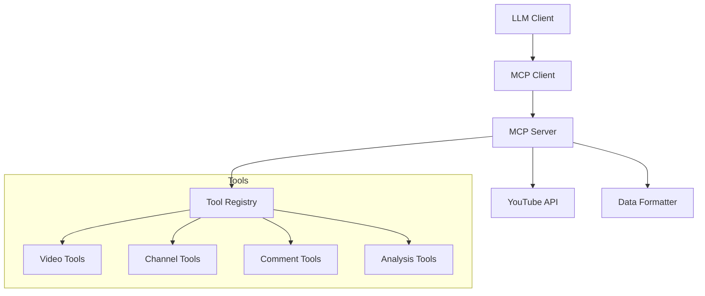

# YouTube MCP Server

Model Contex Protocol (MCP) server that enables AI models to interact with YouTube content through a standardized interface. This server provides a set of tools for video search, content analysis, comment processing, and more.

## 🌟 Features

- 🔍 **Video Search & Discovery**

  - Search YouTube videos
  - Get trending videos
  - Find related content
  - Channel information

- 📊 **Content Analysis**

  - Detailed video information
  - Channel statistics
  - Video transcripts
  - Comprehensive summaries

- 💬 **Social Features**
  - Comment retrieval
  - Comment analysis
  - User interaction data

## 🚀 Quick Start

### Prerequisites

- Python 3.8+
- YouTube Data API credentials
- pip (Python package manager)

### Installation

1. Clone the repository:

```bash
git clone https://github.com/yourusername/youtube-mcp-server.git
cd youtube-mcp-server
```

2. Create and activate a virtual environment:

```bash
python -m venv venv
source venv/bin/activate  # On Windows: venv\Scripts\activate
```

3. Install dependencies:

```bash
pip install -r requirements.txt
```

4. Set up YouTube API credentials:
   - Go to [Google Cloud Console](https://console.cloud.google.com)
   - Create a new project
   - Enable YouTube Data API v3
   - Create credentials (OAuth 2.0 Client ID)
   - Download the credentials and save as `client_secrets.json`

### Configuration

1. Create a `.env` file in the project root:

```env
YOUTUBE_API_KEY=your_api_key_here
```

2. Update the configuration as needed in `config.py`

## 🛠️ Usage

### Starting the Server

```bash
python mcp_videos.py
```

### Available Tools

1. **Search Videos**

```python
@mcp.tool()
async def get_videos(search: str, max_results: int)
```

2. **Get Video Info**

```python
@mcp.tool()
async def get_video_info(video_id: str)
```

3. **Get Channel Details**

```python
@mcp.tool()
async def get_channel_details(channel_id: str)
```

4. **Get Video Comments**

```python
@mcp.tool()
async def get_video_comments_tool(video_id: str, max_results: int = 100)
```

5. **Get Trending Videos**

```python
@mcp.tool()
async def get_trending_videos_tool(region_code: str = "US", max_results: int = 50)
```

6. **Get Related Videos**

```python
@mcp.tool()
async def get_related_videos_tool(video_id: str, max_results: int = 25)
```

7. **Summarize Video**

```python
@mcp.tool()
async def summarize_video(video_id: str, include_comments: bool = True)
```

## 📊 Architecture

The project follows a modular architecture:



## 🔧 Development

### Project Structure

```
youtube-mcp-server/
├── mcp_videos.py          # Main server implementation
├── youtube_api.py         # YouTube API client
├── yt_helper.py          # Helper functions
├── requirements.txt       # Project dependencies
├── .env                  # Environment variables
├── .gitignore           # Git ignore rules
└── README.md            # This file
```

### Adding New Tools

1. Create a new async function in `mcp_videos.py`
2. Decorate it with `@mcp.tool()`
3. Implement the tool logic
4. Add appropriate error handling
5. Update documentation

## 📝 API Documentation

### Response Formats

1. **Video Format**

```python
{
    "title": str,
    "channel_title": str,
    "duration": str,
    "description": str,
    "view_count": int,
    "like_count": int,
    "comment_count": int,
    "url": str,
    "published_at": str
}
```

2. **Channel Format**

```python
{
    "title": str,
    "subscriber_count": int,
    "video_count": int,
    "view_count": int,
    "description": str,
    "published_at": str
}
```

3. **Comment Format**

```python
{
    "author": str,
    "text": str,
    "like_count": int,
    "published_at": str
}
```

## 🤝 Contributing

1. Fork the repository
2. Create a feature branch
3. Commit your changes
4. Push to the branch
5. Create a Pull Request

## 📄 License

This project is licensed under the MIT License - see the [LICENSE](LICENSE) file for details.

## 🙏 Acknowledgments

- [FastMCP](https://github.com/fastmcp) for the MCP framework
- [YouTube Data API](https://developers.google.com/youtube/v3) for the API
- All contributors and users of this project

## 📞 Support

For support, please:

1. Check the [documentation](docs/)
2. Open an [issue](https://github.com/yourusername/youtube-mcp-server/issues)
3. Contact the maintainers

## 🔄 Updates

Stay updated with the project:

- Watch the repository
- Check the [releases](https://github.com/yourusername/youtube-mcp-server/releases)
- Follow the [changelog](CHANGELOG.md)

## 🔒 Security

### Handling Sensitive Data

⚠️ **IMPORTANT**: Never commit sensitive files to the repository:

- `token.pickle`
- `client_secrets.json`
- `.env` files
- Any other credential files

These files are automatically ignored by `.gitignore`, but if you accidentally commit them:

1. Remove them from git tracking:

```bash
git rm --cached token.pickle
git rm --cached client_secrets.json
```

2. Revoke and regenerate any exposed credentials
3. Update your local `.env` file with new credentials
4. Never share or expose these files publicly

### Best Practices

1. Always use environment variables for sensitive data
2. Keep credentials in `.env` file (already in `.gitignore`)
3. Regularly rotate API keys and tokens
4. Use OAuth 2.0 for authentication
5. Monitor GitHub's secret scanning alerts
